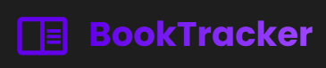
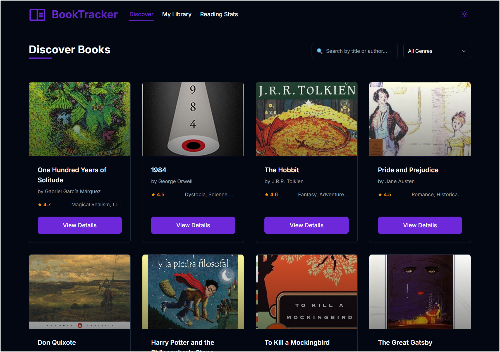

A modern application to manage your book collection, developed with Angular 21.0.2. BookTracker allows you to discover new titles, track your reading progress, and organize your digital library efficiently.
It offers advanced features such as genre search, personalized reading statistics, and reading goal management. 
Built with Angular, TailwindCSS, and RxJS, it presents an elegant interface with light/dark theme support, subtle animations, and a fully responsive design that ensures an optimal experience on any device.



## Table of Contents

- [Key Features](#key-features)
- [Development Environment Setup](#development-environment-setup)
  - [Prerequisites](#prerequisites)
  - [Installation](#installation)
- [Project Structure](#project-structure)
- [Additional Resources](#additional-resources)

## Key Features
- **Discover Books**: Explore a wide collection of books with search and filtering by genre
- **Reading Tracking**: Record your reading progress and set goals
- **Adaptive Interface**: Responsive design with light/dark theme support
- **Smooth Animations**: Enhanced user experience with subtle animations

## Development Environment Setup

### Prerequisites

- Node.js (v18 or higher)
- npm (v9 or higher)
- Angular CLI (v21.0.2)

### Installation

1. Clone the repository:
   ```bash
   git clone https://github.com/rinsdoc/angular-book-app
   ```

2. Install dependencies:
   ```bash
   npm install
   ```

3. Start the development server:
   ```bash
   ng serve
   ```

4. Navigate to `http://localhost:4200/` in your browser

## Project Structure

The project follows a **Hexagonal Architecture** (Ports & Adapters) pattern, organizing code into clear layers:

```
src/
├── app/
│   ├── components/           # UI Components
│   │   ├── book-detail/      # Book detail view
│   │   ├── book-list/        # Books catalog with filters
│   │   ├── book-review/      # Reviews display
│   │   ├── reading-stats/    # Reading statistics
│   │   └── user-library/     # User's personal library
│   ├── domain/               # Domain Layer (Business Logic)
│   │   ├── book.ts           # Book entity
│   │   ├── user-book.ts      # User-Book relationship
│   │   ├── reading-session.ts # Reading session entity
│   │   ├── book-repository.port.ts
│   │   ├── user-book-repository.port.ts
│   │   └── reading-session-repository.port.ts
│   ├── infrastructure/       # Infrastructure Layer (Adapters)
│   │   ├── book-repository.adapter.ts
│   │   ├── user-book-repository.adapter.ts
│   │   └── reading-session-repository.adapter.ts
│   ├── application/          # Application Layer (Use Cases)
│   │   └── book.service.ts   # Book management service
│   ├── services/             # Additional Services
│   │   ├── book.service.ts
│   │   ├── reading-session.service.ts
│   │   └── theme.service.ts  # Theme management
│   ├── app-routing.module.ts # Routing configuration
│   ├── app.component.*       # Root component
│   └── app.module.ts         # Main module
├── assets/                   # Static resources
│   ├── books.json           # Books data
│   ├── user-books.json      # User library data
│   ├── reading-sessions.json # Reading sessions data
│   ├── reviews.json         # Reviews data
│   └── *.png                # Images
└── styles.css               # Global styles with TailwindCSS
```

### Architecture Layers

- **Domain**: Contains business entities and repository ports (interfaces)
- **Infrastructure**: Implements repository adapters that handle data persistence
- **Application**: Contains services that orchestrate business logic
- **Components**: Presentation layer with Angular components

## Additional Resources

These resources will help you better understand the technologies used in BookTracker:

- [Angular Documentation](https://angular.dev/) - Official guide and reference for Angular development
- [Angular Material](https://material.angular.io/) - Material Design components for Angular
- [RxJS](https://rxjs.dev/) - Reactive programming library used in Angular
- [TailwindCSS](https://tailwindcss.com/docs) - CSS framework used for interface design
- [Tailwind Animation](https://github.com/jamiebuilds/tailwindcss-animate) - Plugin for adding animations with Tailwind
