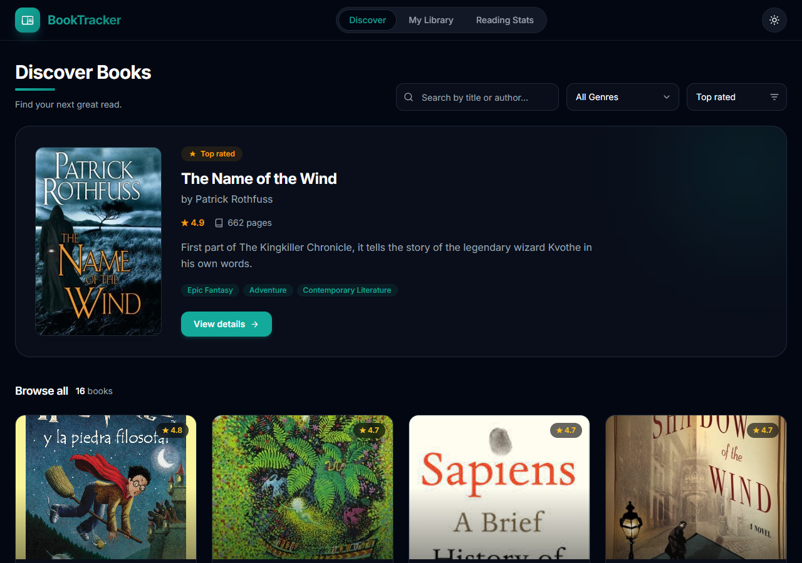
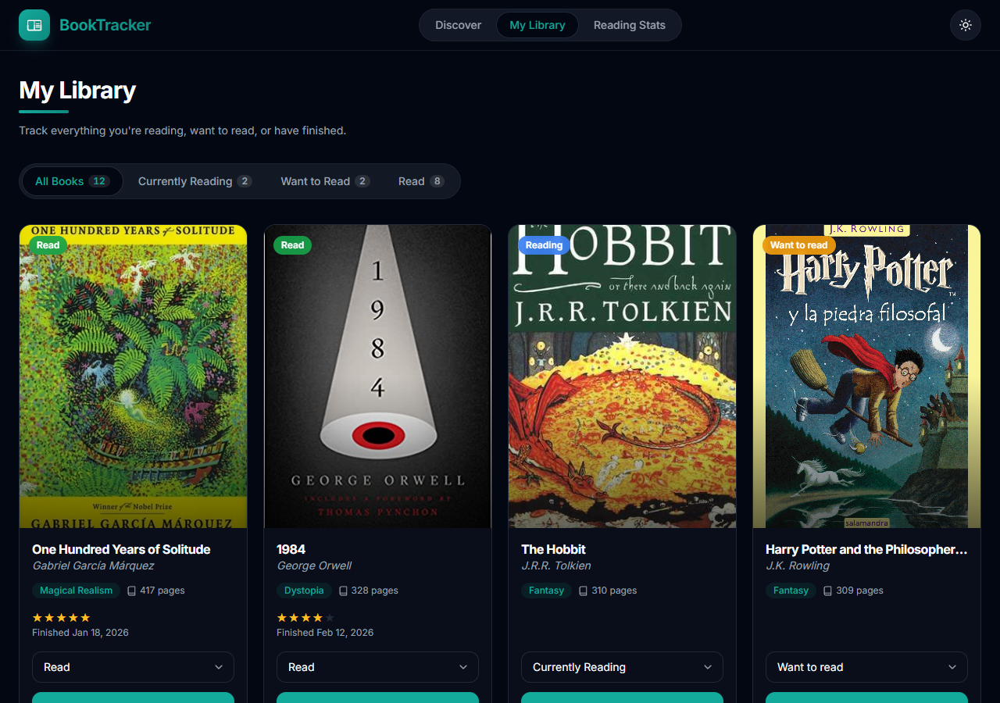
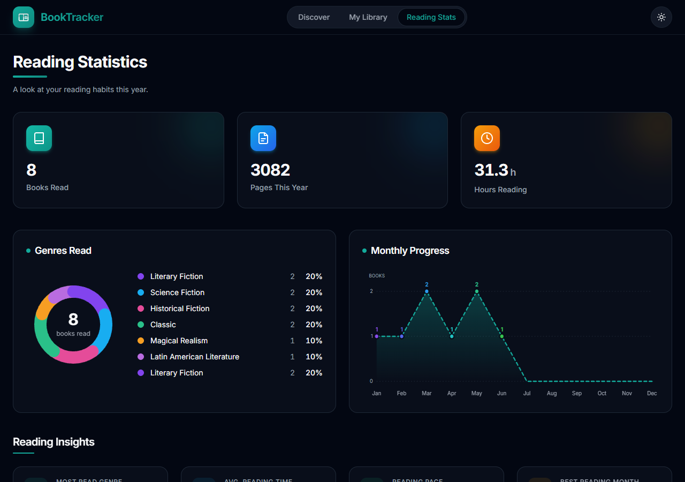
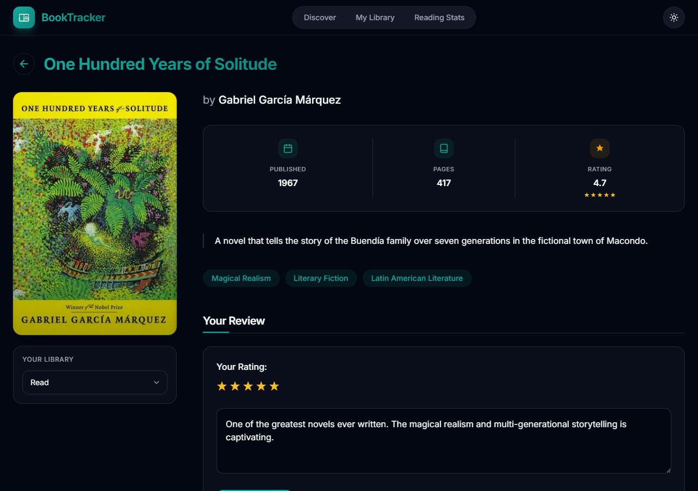

A modern application to manage your book collection, developed with Angular 21. BookTracker lets you discover new titles, track your reading progress, and visualise your reading habits — all in a clean, dependency-light UI with full light/dark theme support.

Built with **Angular 21** (standalone, zoneless), **TailwindCSS 3**, and **RxJS** — no UI component library, no charting library, no icon library.

---

## Screenshots

| Discover | My Library |
|:---:|:---:|
|  |  |

| Reading Statistics | Book Detail |
|:---:|:---:|
|  |  |

---

## Table of Contents

- [Key Features](#key-features)
- [Tech Stack](#tech-stack)
- [Development Environment Setup](#development-environment-setup)
  - [Prerequisites](#prerequisites)
  - [Installation](#installation)
- [Project Structure](#project-structure)
- [Additional Resources](#additional-resources)

## Key Features

- **Discover Books** — browse a curated catalogue with search, genre filter, and sort controls; featured top-rated book hero card
- **My Library** — personal shelf with status tabs (Reading / Want to Read / Read), star ratings, and finish dates
- **Book Detail** — full metadata, genre tags, star rating, and inline user review
- **Reading Statistics** — SVG donut chart for genre distribution, dashed line chart with per-month colours for annual progress, and four reading insight cards
- **Light / Dark theme** — persisted toggle, glass-effect header
- **Responsive design** — mobile-first, optimised for any screen size

## Tech Stack

| Layer | Technology |
|---|---|
| Framework | Angular 21 (standalone components, zoneless CD) |
| Styles | TailwindCSS 3 + CSS custom properties |
| HTTP | Angular `HttpClient` + `firstValueFrom` (RxJS) |
| Charts | Pure SVG (no charting library) |
| Icons | Inline SVG (no icon library) |
| Forms | Native DOM bindings (`[value]` / `(input)`) |
| Data | Static JSON assets |

## Development Environment Setup

### Prerequisites

- Node.js v18 or higher
- npm v9 or higher
- Angular CLI v21

### Installation

1. Clone the repository:
   ```bash
   git clone https://github.com/rinsdoc/angular-book-app
   ```

2. Install dependencies:
   ```bash
   npm install
   ```

3. Start the development server:
   ```bash
   ng serve
   ```

4. Open `http://localhost:4200/` in your browser.

## Project Structure

The project follows **Hexagonal Architecture** (Ports & Adapters), with clear separation between domain, infrastructure, application, and presentation layers.

```
src/
├── app/
│   ├── components/           # Presentation layer
│   │   ├── book-detail/      # Book detail view
│   │   ├── book-list/        # Discover catalogue with filters
│   │   ├── book-review/      # Inline review display
│   │   ├── reading-stats/    # SVG charts & reading insights
│   │   └── user-library/     # Personal reading shelf
│   ├── domain/               # Domain layer (entities & ports)
│   │   ├── book.ts
│   │   ├── user-book.ts
│   │   ├── reading-session.ts
│   │   ├── book-repository.port.ts
│   │   ├── user-book-repository.port.ts
│   │   └── reading-session-repository.port.ts
│   ├── infrastructure/       # Adapters (data access)
│   │   ├── book-repository.adapter.ts
│   │   ├── user-book-repository.adapter.ts
│   │   └── reading-session-repository.adapter.ts
│   ├── application/          # Application services (use cases)
│   │   ├── book.service.ts
│   │   └── reading-session.service.ts
│   ├── app.routes.ts         # Routing configuration
│   ├── app.component.*       # Root shell component
│   └── main.ts               # Bootstrap (standalone, zoneless)
├── assets/
│   ├── books.json
│   ├── user-books.json
│   ├── reading-sessions.json
│   ├── reviews.json
│   └── screenshots/          # README screenshots
└── styles.css                # Tailwind base + design tokens
```

### Architecture Layers

- **Domain** — business entities and repository port interfaces; no framework dependencies
- **Infrastructure** — `HttpClient`-based adapters implementing the repository ports
- **Application** — services that orchestrate use cases across domain and infrastructure
- **Components** — Angular standalone components, purely presentation

## Additional Resources

- [Angular Documentation](https://angular.dev/)
- [RxJS](https://rxjs.dev/)
- [TailwindCSS](https://tailwindcss.com/docs)
