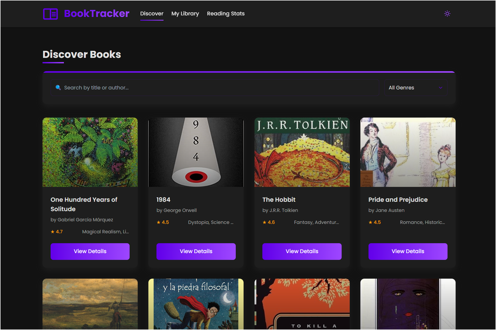

# BookTracker

A modern application to manage your book collection, developed with Angular 19.2.5. BookTracker allows you to discover new titles, track your reading progress, and organize your digital library efficiently.
It offers advanced features such as genre search, personalized reading statistics, and reading goal management.
Built with Angular, TailwindCSS, and RxJS, it presents an elegant interface with light/dark theme support, subtle animations, and a fully responsive design that ensures an optimal experience on any device.



## Table of Contents

- [Key Features](#key-features)
- [Development Environment Setup](#development-environment-setup)
  - [Prerequisites](#prerequisites)
  - [Installation](#installation)
- [Project Structure](#project-structure)
- [Available Scripts](#available-scripts)
- [Additional Resources](#additional-resources)

## Key Features
- **Discover Books**: Explore a wide collection of books with search and filtering by genre
- **Reading Tracking**: Record your reading progress and set goals
- **Adaptive Interface**: Responsive design with light/dark theme support
- **Smooth Animations**: Enhanced user experience with subtle animations

## Development Environment Setup

### Prerequisites

- Node.js (v18 or higher)
- npm (v9 or higher)
- Angular CLI (v19.2.5)

### Installation

1. Clone the repository:
   ```bash
   git clone https://github.com/rinsdoc/angular-book-app
   cd bookverse
   ```

2. Install dependencies:
   ```bash
   npm install
   ```

3. Start the development server:
   ```bash
   ng serve
   ```

4. Navigate to `http://localhost:4200/` in your browser

## Project Structure

```
src/
├── app/
│   ├── components/      # Reusable components
│   ├── pages/           # Main pages
│   ├── services/        # Data management services
│   ├── models/          # Interfaces and types
│   └── shared/          # Shared utilities
├── assets/              # Images and static resources
└── styles/              # Global styles and variables
```

## Available Scripts

- `ng serve` - Starts the development server
- `ng build` - Compiles the project for production
- `ng test` - Runs unit tests with Karma
- `ng lint` - Checks the code with ESLint
- `ng e2e` - Runs end-to-end tests


## Additional Resources

These resources will help you better understand the technologies used in BookTracker:

- [Angular Documentation](https://angular.dev/) - Official guide and reference for Angular development
- [Angular Material](https://material.angular.io/) - Material Design components for Angular
- [RxJS](https://rxjs.dev/) - Reactive programming library used in Angular
- [TailwindCSS](https://tailwindcss.com/docs) - CSS framework used for interface design
- [Tailwind Animation](https://github.com/jamiebuilds/tailwindcss-animate) - Plugin for adding animations with Tailwind
